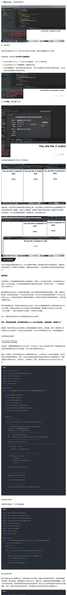

<!--
 * @Author: Topskys
 * @Date: 2022-11-12 21:23:46
 * @LastEditTime: 2022-11-12 21:43:29
-->
# 统计用户在线人数
在统计用户在人数的时候，我们用到了监听器，监听器大致分为以下三种：

1、ServletRequestListener：用于监听请求的监听接口

2、HttpSessionListener：用于监听会话的监听接口

3、ServletContextListener：用于监听应用的回话接口

## 错误的统计办法
**监听Request域**
这种统计办法是错误的认为每次刷新页面后进行进行一次的count++运算
```java
import javax.servlet.*;
import javax.servlet.annotation.WebListener;
import javax.servlet.http.HttpSessionAttributeListener;
import javax.servlet.http.HttpSessionEvent;
import javax.servlet.http.HttpSessionListener;
import javax.servlet.http.HttpSessionBindingEvent;

@WebListener()
public class MyRequestListener implements ServletRequestListener{
    private ServletContext sc;
    private Integer count;
    @Override
    //请求被初始化 Request
    public void requestInitialized(ServletRequestEvent sre) {
        //获取全局域
        sc = sre.getServletContext();
        //将count从全局域中获取出来
        count = (Integer) sc.getAttribute("count");
        System.out.println(count);
        count++;
        System.out.println(count);
        sc.setAttribute("count",count);
    }
}
```
```java
import javax.servlet.ServletContext;
import javax.servlet.ServletContextEvent;
import javax.servlet.ServletContextListener;
import javax.servlet.annotation.WebListener;
import javax.servlet.http.HttpSessionAttributeListener;
import javax.servlet.http.HttpSessionEvent;
import javax.servlet.http.HttpSessionListener;
import javax.servlet.http.HttpSessionBindingEvent;

@WebListener()
public class MyServletContextListener implements ServletContextListener{
    private ServletContext sc;
    @Override
    //Application被初始化的时候创建
    public void contextInitialized(ServletContextEvent sce) {
        Integer count = 0;
        //获取全局域
        sc = sce.getServletContext();
        //将count放入到全局域中
        sc.setAttribute("count",count);
    }
}
```
```jsp
<%@ page contentType="text/html;charset=UTF-8" language="java" %>
<html>
  <head>
    <title>$Title$</title>
  </head>
  <body>
  <center><h1>You are the ${applicationScope.count} customer to visit. </h1></center>
  </body>
</html>
```
这种错误地做法导致的是每刷新一次页面 就会导致count进行累加操作，最终产生错误的在线人数，所以此时想到不应该监听Request域，而应该监听Session域。

**监听Session域**
在第二次监听Session域之后，发现每次刷新页面后不改变count但是在启动不同的浏览器后count++会实现，但是，这样做并不是我们要统计的在线人数，所以此种做法错误。由于代码只是将原来写在Request监听器中的代码转移到Session监听器中，所以其他没变的代码将不重复。
```java
import javax.servlet.ServletContext;
import javax.servlet.ServletContextEvent;
import javax.servlet.ServletContextListener;
import javax.servlet.annotation.WebListener;
import javax.servlet.http.HttpSessionAttributeListener;
import javax.servlet.http.HttpSessionEvent;
import javax.servlet.http.HttpSessionListener;
import javax.servlet.http.HttpSessionBindingEvent;

@WebListener()
public class MySessionListener implements HttpSessionListener{

    private ServletContext sc;
    private Integer count;

    @Override
    //当对话产生时激活此方法
    public void sessionCreated(HttpSessionEvent se) {
        sc = se.getSession().getServletContext();
        count = (Integer) sc.getAttribute("count");
        count++;
        sc.setAttribute("count",count);
    }
}
```
这时我们发现对于在线人数的统计，不是网页访问的次数，也不是浏览器打开的个数，对需求的理解的错误理解。所以正确的做法是统计其IP的数量，这样的话，不管你在一台电脑上开启多少客户端，都会只有一个。
## 正确的统计方法
统计其IP的数量，将IP的数量作为当前的在线人数，那么如何统计IP的数量呢？这样将会导出以下问题：

1、如何获取用户的IP？
2、IP将如何存储？
3、如何判断IP之前已经存在？  

现在来解决这些问题：

1、只能从请求中获取
2、通过2、3问题，我们想到了集合（List），因为集合不仅可以存储任何字符串，还可以通过遍历来判断之前是否有重复的IP出现。
到了这里又冒出来一个问题集合（List）放到哪个域里呢？

ServletContext域
```java
import javax.servlet.ServletContext;
import javax.servlet.ServletContextEvent;
import javax.servlet.ServletContextListener;
import javax.servlet.annotation.WebListener;
import javax.servlet.http.HttpSessionAttributeListener;
import javax.servlet.http.HttpSessionEvent;
import javax.servlet.http.HttpSessionListener;
import javax.servlet.http.HttpSessionBindingEvent;
import java.util.ArrayList;
import java.util.List;

@WebListener()
public class MyServletContextListener implements ServletContextListener{
    private ServletContext sc;

    @Override
    //Application被初始化的时候创建
    public void contextInitialized(ServletContextEvent sce) {
        //创建一个链表来存储IP
        List<String> ips = new ArrayList<>();
        sc = sce.getServletContext();
        //将创建好的链表对象，放到Application域中
        sc.setAttribute("ips",ips);
    }
}
```
由于IP只能在Request域中获取，所以遍历判断在Request域中进行。
```java
import javax.servlet.*;
import javax.servlet.annotation.WebListener;
import javax.servlet.http.*;
import java.util.List;

@WebListener()
public class MyRequestListener implements ServletRequestListener{

    private HttpServletRequest sr;
    private String clientIp;
    private ServletContext sc;
    private List<String> ips;
    private HttpSession session;

    @Override
    //请求被初始化 Request
    public void requestInitialized(ServletRequestEvent sre) {
        //从请求域中获取IP
        sr = (HttpServletRequest) sre.getServletRequest();
        clientIp = sr.getRemoteAddr();
        session = sr.getSession();
        session.setAttribute("clientIp",clientIp);

        //测试
        // System.out.println("clientIp = "+ clientIp);
        //获取Application域中的List
        sc = sre.getServletContext();
        ips = (List<String>) sc.getAttribute("ips");
        //遍历ips
        for (String ip :
                ips) {
            if (clientIp.equals(ip))
                return;
        }
        ips.add(clientIp);
        sc.setAttribute("ips",ips);
    }
}
```
因为要统计在线人数，所以要设置退出按钮，点击退出按钮之后，因为要从List域中移除，所以使用Session域监听器来判断session回话的关闭
```java
import javax.servlet.ServletContext;
import javax.servlet.ServletContextEvent;
import javax.servlet.ServletContextListener;
import javax.servlet.annotation.WebListener;
import javax.servlet.http.*;
import java.util.List;

@WebListener()
public class MySessionListener implements HttpSessionListener{

    private ServletContext sc;
    private List<String> ips;
    private HttpSession session;
    private Object clientIp;

    @Override
    public void sessionDestroyed(HttpSessionEvent se) {
        sc = se.getSession().getServletContext();
        ips = (List<String>) sc.getAttribute("ips");
        session = se.getSession();
        clientIp = session.getAttribute("clientIp");
        //删除ip，如何获取IP，但是不可以从session获取到IP
        //因为Session获取不到Request
        //一个Session包含多个Request
        //一个Request只对应一个Session 所以获取不到，这时只能先从Request域中获取到的ips，放置到Session域
        //然后从Session 域中读取
        ips.remove(clientIp);
        // session一失效就马上将此IP从链表中移除是错误的
        //应该看此IP是否有另外的回话存在，如果有的话不能删除
    }
}
```
此处代码是页面点击关闭后，激活的退出方法
```java
import javax.servlet.ServletException;
import javax.servlet.annotation.WebServlet;
import javax.servlet.http.HttpServlet;
import javax.servlet.http.HttpServletRequest;
import javax.servlet.http.HttpServletResponse;
import javax.servlet.http.HttpSession;
import java.io.IOException;

@WebServlet(name = "LogoutServlet",urlPatterns = "/logoutServlet")
public class LogoutServlet extends HttpServlet {

    private HttpSession session;

    protected void doPost(HttpServletRequest request, HttpServletResponse response) throws ServletException, IOException {
        //从域中获取一个session，设置为false 如果域中存在一个session，则直接获取，如果不存在，则返回一个空的session
        session = request.getSession(false);
        if (session != null){
            //使session失效
            session.invalidate();
            //失效后，需要进行的操作，List链表中需要减去，用到了Session域监听器
        }
    }

    protected void doGet(HttpServletRequest request, HttpServletResponse response) throws ServletException, IOException {
        doPost(request,response);
    }
}
```
在jsp页面进行读取的时候，因为ips是以List链表的形式存在的，所以要想判断当前在线人数，所以必须要判断链表的长度，所以是applicationScope.ips.size()

```jsp
<%@ page contentType="text/html;charset=UTF-8" language="java" %>
<html>
  <head>
    <title>$Title$</title>
  </head>
  <body>
  <center><h1>You are the ${applicationScope.ips.size()} customer to visit. </h1><br>
    <h3><a href="${pageContext.request.contextPath}/logoutServlet">
      安全退出
    </a></h3>
  </center>
  </body>
</html>
```
好了?，这时候，程序写完了，如何判断呢？

此时，我们的程序是部署在本地的Tomcat上的，对于本台电脑，只有一个IP，如何实现多个IP呢？其实啊我们的电脑可以有三个IP，在访问服务器的时候，服务器的IP多写几个，相当于本机的IP多出来几个。是哪三个IP呢？
<></>

### 最完美的代码
所以在点击退出登录的按钮之后，不可以直接将IP移除，要判断有没有另外的回话存在，如果有另外的回话存在，此IP是不可以删掉的，问题由此变的复杂了，因为还要统计此IP所发出的会话有多少。

**整体思路：**

在全局域中，将不是直接将iP存放在List的链表中，而是以一个Map的形式存在，Map的键为String类型，Key为List类型，List中存放的是当前IP所激发的会话对象，这样就可以统计，一个IP触发的sessions有多少个。

通过调用Map的get方法，将当前IP最为参数，将可以获取到他所激发的会话集合。但是，此集合可能为空，因为有可能当前IP一次也没有访问此页面，所以在List为空的时候好要创建一个ArrayList来存放sessions，然后将变化后的List重新写回到Map，再将变化后的Map写回到全局域中 。这样创建过程基本完成。

然后考虑销毁过程，IP还需方法放到Session域中，当session被销毁的时候，应该把当前Session从List 中删除，但是Map中此sessions对应的IP可是不能直接删，要判断List中的sessions的个数（Entry对象），个数为1的时候才可以删除，不然就不可以删除。

所以，要将当前IP通过Request域存放到当前Session域中，

然后，要考虑的问题是，每次刷新页面后sessions的个数会增加，这是错误的，原因是什么？

答案是，因为在存放sessions的时候，创建数组直接进行的添加，这样的话，每次一刷新页面，就会导致sessions的添加，所以在此之前应该判断，sessions中是否有此session，有的话直接跳出。

这样添加就没问题了

**Servlet域中添加Map**
在Map中，需要使用键值对的方式,Key为IP，Value为List，那么List中存放什么呢？存放的是此IP发出的所有回话的HttpSession的对象，所以List的泛型是HttpSession。

请求，在请求中，因为将当前Session 对象存放到List中， List在Map中，Map在全局域中，所以首先得从全局域获取到Map，然后，从Map中获取由当前IP所发出的所有Session的组成的List，判断当前的List是否为NULL，若为NULL，则创建List，否则，将当前SessioncurrentSession放入List中。
```java
import javax.servlet.*;
import javax.servlet.annotation.WebListener;
import javax.servlet.http.*;
import java.util.ArrayList;
import java.util.List;
import java.util.Map;

@WebListener()
public class MyRequestListener implements ServletRequestListener{

    private HttpServletRequest sr;
    private String clientIp;
    private ServletContext sc;
    private List<String> ips;
    private HttpSession currentSession;
    private Map<String,List<HttpSession>> map;
    private List<HttpSession> sessions;


    @Override
    //请求被初始化 Request
    public void requestInitialized(ServletRequestEvent sre) {
        //从请求域中获取IP
        sr = (HttpServletRequest) sre.getServletRequest();
        clientIp = sr.getRemoteAddr();
        currentSession  = sr.getSession();
        //将当前Session 对象存放到List中， List在Map中，Map在全局域中，
        sc = sre.getServletContext();
        map = (Map<String, List<HttpSession>>) sc.getAttribute("map");
        //从Map中获取由当前IP所发出的所有Session的组成的List
        sessions = map.get(clientIp);
        //判断当前的List是否为NULL，若为NULL，则创建List，否则，将当前Session放入List
        if (sessions == null){
            sessions = new ArrayList<>();
        }
//        遍历List的session 对象，若有则不添加，若没有则添加
        for (HttpSession session :
                sessions) {
            if (session == currentSession)
                return;
        }
        sessions.add(currentSession);


        //将变化过的List重新写回到Map
        map.put(clientIp,sessions);
        //再将变化的Map写回到全局域中
        sc.setAttribute("map",map);

        //将当前IP放入到当前Session
        currentSession.setAttribute("clientIp",clientIp);
    }

}
```
**ServletContext**
这里将不使用ips了，所以将其删除
```java
import javax.servlet.ServletContext;
import javax.servlet.ServletContextEvent;
import javax.servlet.ServletContextListener;
import javax.servlet.annotation.WebListener;
import javax.servlet.http.*;
import java.util.ArrayList;
import java.util.HashMap;
import java.util.List;
import java.util.Map;

@WebListener()
public class MyServletContextListener implements ServletContextListener{
    private ServletContext sc;
    @Override
    //Application被初始化的时候创建
    public void contextInitialized(ServletContextEvent sce) {
        //创建一个Map，key为IP，value为该IP上所发出的会话的对象
        Map<String,List<HttpSession>> map = new HashMap<>();
        sc = sce.getServletContext();
        //将map放到全局域中
        sc.setAttribute("map",map);
    }
}
```
**Session监听器**
接下来剖析Session的删除工作，获取当前Session对象，这里有之前传递过来的IP，在进行删除操作的时候，要注意此处，删除的是List中的sessions，删除之后，还要判断其IP的是否要删除，如果List中没有该元素，则说明当前IP所发出的会话全部关闭，就可以从map中将当前IP对应的Entry对象删除，否则，当前IP所发出的会话任存在，那么使用put方法将变化过的List写回到map。
```java

import javax.servlet.ServletContext;
import javax.servlet.ServletContextEvent;
import javax.servlet.ServletContextListener;
import javax.servlet.annotation.WebListener;
import javax.servlet.http.*;
import java.util.List;
import java.util.Map;

@WebListener()
public class MySessionListener implements HttpSessionListener{

    private ServletContext sc;
    private List<String> ips;
    private HttpSession currentSession;
    private String clientIp;
    private Map<String,List<HttpSession>> map;
    private List<HttpSession> sessions;

    @Override
    public void sessionDestroyed(HttpSessionEvent se) {
        sc = se.getSession().getServletContext();

        currentSession = se.getSession();
        clientIp = (String) currentSession.getAttribute("clientIp");
        map = (Map<String, List<HttpSession>>) sc.getAttribute("map");
        //从Map中获取List
        sessions = map.get(clientIp);
        //从List中删除当前Session对象
        sessions.remove(currentSession);
        //如果List中没有该元素，则说明当前IP所发出的会话全部关闭，就可以从map中
        //将当前IP对应的Entry对象删除
        //若List中仍有元素，当前IP所发出的会话任存在，那么将变化过的List写回到map
         if (sessions.size() == 0){
             map.remove(clientIp);
         }else {
             map.put(clientIp,sessions);
         }
         sc.setAttribute("map",map);
    }
}
```
因为处理的退出的页面/logoutServlet不需要做任何不同的处理，所以这里将不再重复。

因为在jsp用到了JSP标准库，所以到导两个包。
```jsp

<%@ page contentType="text/html;charset=UTF-8" language="java" %>
<%@ taglib prefix="c" uri="http://java.sun.com/jsp/jstl/core" %>
<html>
  <head>
    <title>$Title$</title>
  </head>
  <body>
  <center><h1>You are the ${applicationScope.map.size()} customer to visit. </h1><br>
    <h3><a href="${pageContext.request.contextPath}/logoutServlet">
      安全退出
    </a><br></h3>
    <h2>
      <c:forEach items="${map}" var="entry">
        ${entry.key }=${entry.value.size()}<br>
      </c:forEach>
    </h2>
  </center>
  </body>
</html>
```
最后 测试成功，这就是一个完美的统计当前用户的在线人数。
来源：blog.csdn.net/gsjwxhn/article/details/90707571
